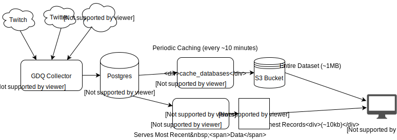

# :space_invader: gdq-collector
> Data Collection Utilities for [GDQStatus](http://gdqstat.us)

(Successor to [sgdq-collector](https://github.com/bcongdon/sgdq-collector))

## Explanation

`gdq-collector` is an amalgamation of services and utilities designed to be a serverless-*ish* backend for [gdq-stats](https://github.com/bcongdon/gdq-stats). There are 3 distinct components of the project:

* `gdq_collector` (the python module) - Python scraping module designed to be run constantly on a compute platform like EC2 which updates a Postgres database with new timeseries and GDQ schedule data.
* `lambda_suite` - Lambda application that caches the Postgres database to a JSON file in S3 (to reduce the load on the Database). Also includes a simple API to query recent timeseries data that doesn't appear in the cached JSON.
* `lambda_monitoring` - Lambda application to monitor the output of the `lambda_suite` API to check system health. Publishes to an SNS topic for notifications.

`gdq_collector` uses [APScheduler](https://apscheduler.readthedocs.io) its schedule and execute the scraping / refreshing tasks.

Both Lambda applications use [Zappa](https://github.com/Miserlou/Zappa) for deployment.

### Architecture Diagram

## Building / Running

### gdq_collector

*Note*: If you're running this on an Ubuntu EC2 instance, [bootstrap_aws.sh](bootstrap_aws.sh) will be more useful then the following bullet list for specific setup.

1. Clone the repo and `cd` into the root project directory.
2. Pull down the dependencies with `pip install -r requirements.txt --user`
    * You may wish to run `aws/install.sh`, as there will be necessary system dependencies to install some of the python packages.
3. Copy `credentials_template.py` to `credentials.py`. Fill in your credentials for Twitch, your Postgres server, and Twitch.
    * You'll need to [register](https://www.twitch.tv/kraken/oauth2/clients/new) a new Twitch application to get your `clientid`.
    * You'll want to use [this](https://twitchapps.com/tmi/) site to generate an `oauth` code for Twitch.
4. Ensure your Postgres server is running and that your credentials are valid. Create the necessary tables by executing the SQL commands in `schema.sql`
5. Run `python -m gdq_collector` to start the collector.
    * You can run `python -m gdq_collector --help` to learn about the optional command line args.

### lambda_suite

1. Clone the repo and `cd` into the root project directory.
2. Pull down the dependencies with `pip install -r requirements.txt --user`
    * You may wish to run `aws/install.sh`, as there will be necessary system dependencies to install some of the python packages.
3. Copy `credentials_template.py` to `credentials.py`. Fill in your credentials for  your Postgres database.
4. Update `zappa_settings.json` to fit your AWS configuration. Of particular note is that you'll need to update your `vpc_config`. You'll also need to make an S3 bucket that matches your `S3_CACHE_BUCKET` config.
5. Run `zappa deploy dev` to deploy the application and schedule the caching operations.

### lambda_monitoring

Follow essentially the same directions as `lambda_suite`, with the exception that the only variable in your `credentials.py` is `sns_arn`, which corresponds to the ARN of the SNS topic that is notified when the health-check fails.
